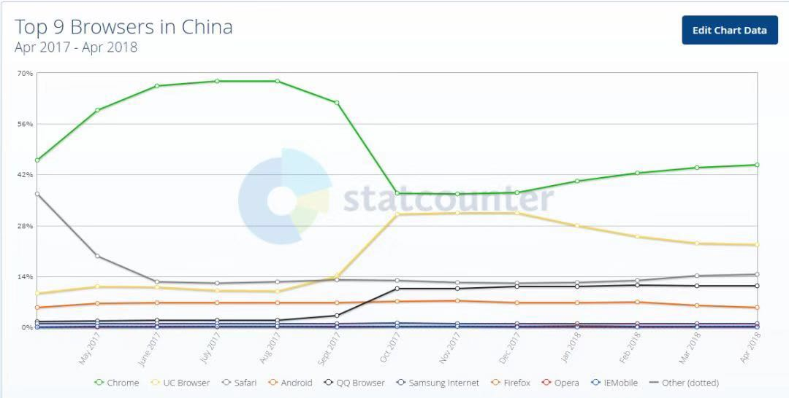

## 总结

1. 移动web的概念
2. 移动web开发方式和常见网页布局方式
3. 移动web开发的基本知识
4. 视口的概念和配置
5. 像素的概念和二倍图原理
6. CSS预处理器的概念
7. less预处理器的基本语法和编译
8. 移动京东的项目搭建
9. 公共样式的定义
10. 顶部通栏的布局
11. 轮播图的布局
12. 导航条的布局
13. 秒杀商品布局
14. 京东超市布局

## 移动web课程介绍

### 1. 什么是移动web

1. 什么是移动web： 在移动端(手机端)的web应用程序 简单来说就是手机浏览器打开的网站
2. 为什么要学习移动web
  1. 因为传统我们开发的PCweb在移动端显示的时候默认会缩放需要用户手指拖放才能正常显示 用户体验差 所以要针对手机的屏幕来开发一个合适的网站
  2. 现在使用手机上网的用户比电脑要多很多 移动端的网站需求越来越大 所以移动web开发的需求也越来越大


### 2. 移动web和传统PC web区别

	1. 页面大小不一样 PC web 大 针对电脑屏幕  移动web小 针对的是手机屏幕
	2. 页面的布局方式不一样 PC web  元素大小都是固定宽高  移动web 元素宽高是动态的 rem 或者 % 全屏盛满整个页面 


### 3. 移动web和移动App的区别

  1. 移动web(webApp)指的是手机浏览器打开的网页 (网页版的淘宝京东 百度 这些使用我们HTML+CSS+JS写的网页 )
  2. 移动App(原生App Native App)是指需要下载安装的应用程序 (QQ 微信 等 这些都是使用原生的安卓IOS语言开发的应用程序)
  3. 什么是H5的App(H5混合原生的App Hybrid App)  是使用HTML5+CSS+JS开发的网站 通过原生的App外壳进行打包 (饿了么外卖  百度知道 知乎 唯品会 等一些虽然需要下载安装但是里面还是用 web技术开发的页面) 
  4. 优缺点
        1. 开发效率 webApp > 混合App > 原生App
            2. 运行效率 原生App > 混合App > webApp
                3. 开发成本 原生App > 混合App > webApp
                    4. 应用场景 
      1. webApp 网页一些简单的web网页 
      2. 混合App 一些稍微复杂但性能要求不是很高的
      3. 原生App 复杂且对性能要求高的App


### 4. 移动端的浏览器

1. 在移动端，仅有四个独立的浏览器内核，分别为微软的Trident、火狐的Gecko、开源内核Webkit、Opera的Presto。
    目前微软的Trident在移动终端上主要为WP7、8系统内置浏览器。Opera的Presto内核主要为 Opera Mobile、OperaMini、欧朋浏览器以及欧朋HD Beta版。Webkit内核的适用范围则较为广泛，Android原生浏览器、苹果的Safari、谷歌Chrome(Android4.0使用) 都是基于Webkit开源内核开发的。


  

2. UC、Android内置、Chrome、Safari、QQ Browser都是webkit内核，从图上看占了绝大部分的市场份额。
    所以一定要伺候好webkit。 有的公司干脆只兼容webkit浏览器


## 移动web开发方式

1. 响应式开发： 写一个页面同时适配多个终端
2. 原生的移动web开发： 分别针对每个端都写一套代码  PC端写一套代码 移动端写一套代码
    1. PC端一般使用固定宽高的布局
    2. 移动端全屏撑满整个页面 全屏100%  使用百分比布局（流式布局）
        目前最流行最先进的方式rem布局方式


## 移动端的布局方式

1. 百分比(流式)布局  （PC和移动端都能用）
2. flex伸缩布局  (PC和移动端都能用  广泛用在移动端)
3. rem布局      (移动端 相对单位相对根元素的字体大小)
4. 响应式布局 (用在网站同时兼容PC移动端的网站)
    注意以上布局方式不是每个页面只能使用这一种 你可以根据需求根据效果灵活搭配使用
    百分比+flex
    百分比+rem
    flex+rem
    百分比+flex+rem

能使用百分比就使用百分比  不能使用百分比使用rem 不能用rem用固定宽高

能用flex优先flex  不能使用flex 使用浮动  浮动也解决不了的就用定位

## 移动端的调试方式
1. 使用浏览器自带的手机模拟器
2. 使用(手机)真机调试

## 移动web开发的基本知识

### 1. 移动端的站点 以m开头

  1. m.jd.com
  2. m.taobao.com

    移动端页面结构
    搜索框
    轮播图
    导航条
    商品
    底部
    移动端页面的内容比较简单 样式也简单
    移动端页面核心： 用户体验（UI界面效果 加载速度快）  功能方便快捷  考虑各种手机屏幕适配

### 2. 视口

#### 1. 视口的概念: 

  ```
  我们经常在开发中会使用到例如width:50%这样的代码去布局。它表示占用父元素的百分比宽度。我们看html文档结构知道最外层的一层是html元素。那么html元素的父元素是什么？这就是要说得视口了。在CSS标准文档中，它被称为初始父容器。这个父容器是所有CSS百分比宽度推算的根源。
    1. 在PC端 视口的宽度是和浏览器窗口可视区域宽度一致
    2. 在移动端 视口的宽度是固定值 一般为980
  ```

#### 2. 为什么手机端视口要设为980px?

  ```
  当年乔布斯设想：苹果手机如果在市场上火爆了，但是各个网站还没有来得及制作手机端网页，那么用户不得不用手机访问电脑版的网页，如何用小屏幕访问大屏幕的页面也同样可读呢？乔帮主就想着为手机固定一个视口宽度，让手机的视口宽度等于世界上绝大多数PC网页的版心宽度，就是980px。这样，用手机访问电脑版网页的时候，旁边刚好没有留白。不过页面缩放后文字会变得非常小，用户需要手动放大缩小才能看清楚，体验非常差
  ```

#### 3. 约束视口(手动修改视口大小)

为了解决移动端网页缩放问题 通过meta标签设置视口的默认值

```html
<!-- 快捷键 meta:vp-->
<meta name="viewport" content="width=device-width,initial-scale=1.0,user-scalable=no,minimum-scale=1.0,maximum-scale=1.0">
```

```
width=device-width 设置视口默认宽度 为设备的真实宽度
initial-scale=1.0 设置视口默认缩放比例 为 1
user-scalable=no 是否允许用户拖放 no不允许 yes允许
minimum-scale=1.0 最小缩放
maximum-scale=1.0 最大缩放
```

#### 4. 视口总结

这个视口的标签告诉浏览器怎么渲染网页。在这里，标签想表达的意思是：按照设备的宽度（device-width）来渲染网页内容。事实上，在支持这个标签的设备上给你看一看效果，你就明白了。

约束视口后

不错呀！用户体验大大改善！！！
此时如果用document.documentElement.clientWidth来测试浏览器屏幕宽度，你会发现当前视口宽度等于手机屏幕的宽度，约束后的视口宽度都是在320~480之间（手机竖直使用的时候）。
这个视口的尺寸，是手机厂商设置的，能够保证我们的文字比如16px，在自己的这个视口下清晰、大小刚刚合适。所以大屏幕的手机的约束视口 > 小屏幕手机的约束视口。这就能够保证我们的网页可以用px写字号、写行高。
**需要注意的是：约束之后的视口宽度，不是自己的分辨率！！每个手机的分辨率，都要比自己的视口宽度大得多得多！**
**最最重要的一句话：前端开发工程师，写代码丝毫不关心手机的分辨率，我们只关心视口**

#### 5. 视口相关单位

1. vw、vh、vmin、vmax 的含义
   1. vw、vh、vmin、vmax 是一种视窗单位，也是相对单位。它相对的不是父节点或者页面的根节点。而是由视窗（Viewport）大小来决定的，单位 1，代表类似于 1%。
      视窗(Viewport)是你的浏览器实际显示内容的区域—，换句话说是你的不包括工具栏和按钮的网页浏览器。
   2. 具体描述如下：
      vw：视窗宽度的百分比（1vw 代表视窗的宽度为 1%）
      vh：视窗高度的百分比（1vh 代表视窗的高度为 1%）
      vmin：当前 vw 和 vh 中较小的一个值
      vmax：当前 vw 和 vh 中较大的一个值
      单位的详解： https://www.cnblogs.com/lidongfeng/p/7243650.html
      vw、vh、vmin、vmax应用场景： https://blog.csdn.net/ZNYSYS520/article/details/76053961(移动端横屏竖屏字体大小保持一致)
2. %: 百分比 也是一个相对单位 但是百分比参照的是父元素 不一定和视口一样


### 3. 移动端的像素

1. 设备像素（Device Pixel）：物理分辨率像素，设备能控制显示的最小单位，我们常说的1920×1080像素 1334*750像素 分辨率就是用的设备像素单位
2. 设备独立像素（Device Independent Pixel）：真实像素 与设备分辨率无关的逻辑像素，代表可以通过程序控制使用的虚拟像素，是一个总体概念，包括了CSS像素
  
3. CSS像素（CSS Pixel）：视口像素 适用于web编程，指的是我们在样式代码中使用到的逻辑像素，是一个抽象概念，实际并不存在

4.  设备像素(物理分辨率像素) 设备独立像素(真实像素) CSS逻辑像素(视口像素)的关系
    1. PC端 因为通常PC端 分辨率 和 真实像素 和 视口像素 一样 所以 物理1px == 真实1px == CSS1px
    2. 移动端 因为移动端通常 分辨率 是 真实像素的 2倍 (视口通常设置和真实像素一样) 所以 物理2px = 真实1px ==  CSS1px
    3. 一般如果分辨率比真实像素 大 就表示这种屏幕是retina屏幕 (视网膜高清屏) 如果分辨率和真实一致表示普通屏幕


### 4. 移动端设计图 和 移动端二倍图的原理

  1. 移动端设计稿一般是按照分辨率设计的 （为了保证图片在分辨率里面不会失真）
  2. 但是分辨率是真实像素和CSS像素的2倍 所以 写代码的时候量设计稿的px 都要缩小一半来写CSSpx
  4. 例如量了750宽度 只能写375  量了80 只能写40（一般设计师会标好 也要按照标好的一半来写）

### 5. 后续3倍 4倍 解决方案都一样

1. 设计师会设计3倍图片 和设计稿   写页面的时候 缩小3倍来
    2倍设计稿 640px 常见设备 iphone 4 / 5   720px 常见设备 中低端安卓手机小米 三星  750px 常见设备 iphone 6 / 7 / 8   
    3倍 1125px 常见设备 iphonex     1080px 常见设备 3倍 高端安卓手机小米三星

### 6. 移动的其他知识  
1. [移动端一些常见的单位](http://www.woshipm.com/pmd/176328.html)
2. [移动端的各种像素的概念](http://www.cnblogs.com/jiangzilong/p/6700023.html)


## 移动web项目实战移动jd项目

### 1. 搭建京东移动端项目

1. 创建jd项目文件夹
2. 打开1-教学资料 》 jd完整版 》 复制 image+lib文件夹 放到你自己的jd里面
3. 搭建页面 写视口 引包


### 2. 移动端JD项目


### 3. 搭建项目的结构

1. 创建一个jd的文件夹
2. 打开 1-教学资料 > jd完整版 把images和lib复制到你创建的jd项目
3. 进入jd文件夹创建index.html主页
4. 给页面添加视口
5. 页面引包
    创建项目需要的less文件夹  index.less
    和js文件夹  index.js
6. 项目初始样式（没有使用框架需要自己写样式初始化代码）
   创建一个base.less公共样式文件
   移动端常见的样式初始化：
      1. 移动端需要设置盒模型为border-box 防止页面出现水平滚动条

      2. 移动端要去除标签点击高亮

      3. 去除图片3px间隙

       移动端公共的样式
         1.浮动
         2.清除浮动

   其他的一些针对移动端兼容的样式  https://www.jianshu.com/p/cb2d8ca8cff2

### 4. jd首页的百分比(流式布局)


## 总结

1.  移动web： 在手机浏览器里面打开的网页  在App里面打开的一些网页(微信公众号 支付生活号  只要能分享的都是网页)

2. 移动端浏览器： 通常都是webkit内核的浏览器  兼容比较好 大胆的使用H5C3

3. 移动端的视口： 是浏览器显示网页的窗口  PC端和窗口一样大 并且随着窗口变化而变化  但是移动端默认不是和窗口一样大 是980  但是现在不需要这个980默认视口 需要手动修改能够和设备的真实宽高一样

   meta:vp 快速生成标准视口

4. 像素的概念： 物理(分辨率)像素 设备独立(真实)像素  CSS(逻辑)像素

   在PC端 3种像素一样 比例是 1:1:1

   在移动端 通常分辨率比真实像素大倍 甚至倍

   2倍 2:1:1

   3倍3:1:1

​       通过js属性查看设备的像素比(物理和真实像素比例)

​	 window.devicePixelRatio   简称dpr

5. 因为分辨率比真实像素大2倍 页面最终在分辨率显示 到分辨率网页整体会放大 设计稿是按照分辨率去设计的 写代码不能按照设计图来写代码 要按照真实像素(视口大小写代码)   使用移动端针对设计稿的大小所有都要/2  以后可能还有会/3  甚至/4


6. 搭建jd项目 
7. 移动端样式初始化

   1. box-sizing:border-box; 防止元素设置padding border超出页面宽度出现横向滚动条
   2. -webkit-tap-highlight-color: transparent; 清除移动端点击的高亮背景色

8. 写jd主页优先使用id选择器作为容器 写页面大容器结构
9. 使用百分比完成jd首页布局