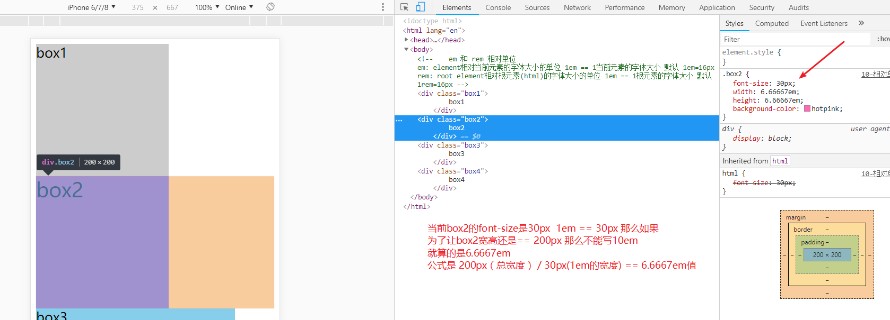
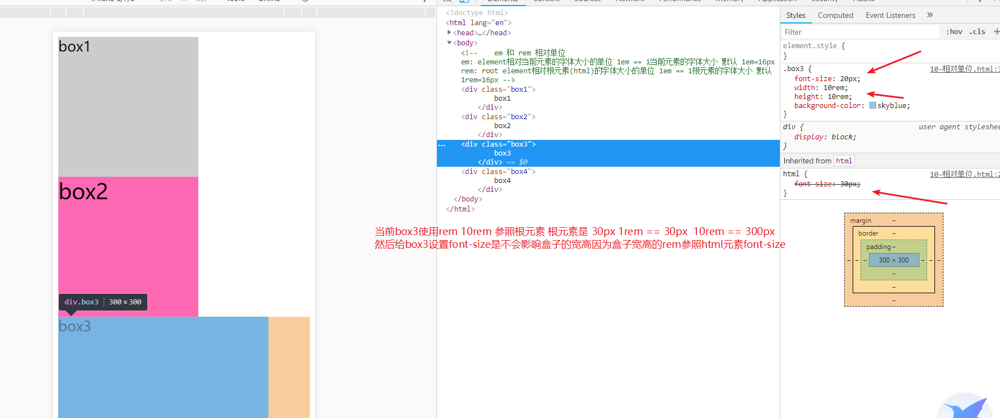
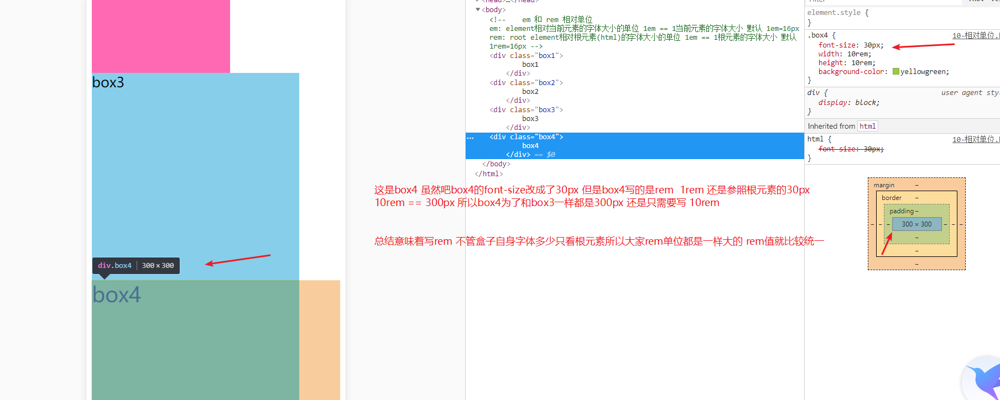
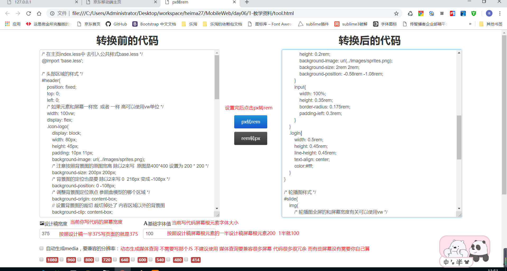

## 总结

1. 主体商品布局
2. 秒杀商品布局
3. 京东超市布局
4. 底部的布局
5. 移动端页面屏幕适配原理
6. 使用rem相对的单位来实现jd主页屏幕适配
7. 轮播图插件的使用
8. 顶部搜索的背景色渐变
9. 倒计时JS功能
10. 轮播图JS效果 插件的使用 ( swiper插件)
11. 上网的原理和移动端真机调试

## flex布局 

参考文档 http://www.runoob.com/w3cnote/flex-grammar.html

### flex布局介绍
* 绝对布局有什么问题
    * 宽高固定
    * 不能适应各种尺寸的屏幕
    * 需要大量的坐标的计算
* flex布局可以做什么？
    * 按比例分配父盒子空间，并且跟随父盒子缩放自动按比例排布
    * 自动换行与排列方向
    * 各种对齐方式

### flex布局容器和子元素

  1. flex布局 分为子元素父元素 属性分为父元素(父容器)和子元素(子项目)
  2. flex 还分主轴 和 侧轴  围绕主轴侧轴来开展的布局

## 父容器属性
    1. display:flex; 只要要使用flex布局必须给父元素设置属性 才能让里面子元素按照伸缩布局方式显示
    2. flex布局方向分为2种 水平和垂直 flex-direction改变主轴方向
        row 水平   默认值
        row-reverse 水平反方向
        column 垂直
        column-reverse 垂直反方向
        改了主轴后 侧轴也会跟着变 跟主轴相反的
    3. 主轴对齐方式 justify-content  
        flex-start 主轴起点  默认
        flex-end 主轴终点
        center 主轴中间
        space-between 主轴2端
        space-around 主轴的四周环绕
        主轴根据 flex-direction 来控制的 默认值水平 默认 justify-content  水平对齐
        如果修改了主轴方向 justify-content  控制的对齐也会修改
    4. align-items 侧轴对齐方式(单行)
            flex-start 侧轴起点
            flex-end 侧轴终点
            center 侧轴居中
            baseline 侧轴第一行文字基线 (子元素文字第一行文字大小不一样才能看出来)
            stretch 默认 拉伸
    5. flex-wrap 换行
        nowrap 不换行 默认值
        wrap 换行
        如果需要换行子元素要有宽度当放不下就换行
    6. algin-content 多行情况下的侧轴的对齐方式
        多行情况下 主轴是水平 设置align-content 控制垂直的多行对齐方式
        flex-start 侧轴起点 
        flex-end 侧轴终点
        center 侧轴中间
        space-between 侧轴2端
        space-around 侧轴的四周环绕
        stretch 拉伸 默认值
    
## 子容器属性

    1. flex 控制子元素占据父元素的百分比
      计算方式 当前子元素的flex的值 / 是所有子元素的flex值和 就能求出当前子元素占的百分比
      如果子元素都为flex:1 那么子元素变多变少都会保持一样的比例就无需计算
    2. order 属性  值是数字
       order属性控制子元素的排列顺序。数值越小，排列越靠前，默认为0。
    3. flex-grow 属性 值是数字
       flex-grow属性定义项目的放大比例，默认为0，即如果存在剩余空间，也不放大
    4. flex-shrink属性
       flex-shrink属性定义了项目的缩小比例，默认为1，即如果空间不足，该项目将缩小
    5. align-self属性
        设置当个子元素的对齐方式
        align-self: auto | flex-start | flex-end | center | baseline | stretch;


## 使用flex布局实现经典的网页布局

## 使用flex布局实现携程首页布局

## 移动端页面屏幕适配

1. 为什么要适配屏幕： 手机屏幕很小 页面都是全屏 不同的大小的屏幕 展示内容不一样 
2. 希望页面在任何屏幕都保持一个等比例  希望每个屏幕看到的效果都是一样的
3. 手机小 页面文字 图片 所有内容 都比较小 
4. 手机大 页面文字 图片 所有内容 都比较大

## 使用相对的单位来实现屏幕适配

1. em : element 相对自身元素的字体大小 
   div自身字体大小16  1em=16px
   div自身字体大小20  1em=20px

2. rem : root element 相对根元素的字体大小 
    html元素的字体大小16px 1rem = 16px
    html元素的字体大小30px 1rem = 30px

3. 相对单位的概念就这个单位的值不是固定的 而是参照字体大小而变化而变化  

4. em 和 rem的区别和对比

    

    

    

    


## rem适配的原理

1. 页面中都把px写成rem相对单位 都相对根元素的字体大小

2. 不同屏幕改变根元素的字体大小的值

3. 使用媒体查询方式改变根元素大小值

    ```css
    @media(width:750px){
      html{
        font-size:200px;
      }
    }
    @media(width:375px){
      html{
        font-size:100px;
      }
    }
    ```

    

4. 使用 vw单位来实现rem适配 (最简单 最先进 可能有兼容性) 如果有兼容性 引入上面js

  1. 先假设你写代码屏幕宽度  和 当前写带屏幕宽度根元素字体大小

  2. 如果使用2倍图 缩小2倍来大小 按照真实开发屏幕 375去写代码去调试 根元素 假设100

      在375屏幕vw值  100px / 375  * 100    26.66667vw

  3. 如果使用原图写代码 和设计稿原图一样大 750去调试 根元素 假设 100px

      在求750屏幕的vw值  100px / 750 * 100  13.33333vw


## 使用rem实现 jd页面的屏幕适配 （注意只有原生移动web才能使用rem  响应式开发不能使用）

1. 原理把页面的px转成rem单位

2. 根元素字体大小要随着屏幕变化而变化（等比例变化）

3. 根元素字体变化 页面使用rem单位的大小也会自动跟着变化

4. rem实现屏幕适配原理

   

5. rem 改变根元素的公式计算

   

## px转rem插件和工具使用

### 1. vscode 插件


### 2. px转rem本地工具  教学资料里面的tool.html




## 总结

  1. 首页布局 秒杀布局 秒杀标题使用伸缩布局两端对齐
    秒杀内容 flex布局 每个人flex:1
    not(nth-child(3n))排除伪类
    li~li 相邻后面的所有兄弟 排除第一个选择器
  2. 京东超市 使用伪元素添加 小红线  后面内容flex布局 边框 使用类名去加
  3. 底部 使用flex布局 每个flex:1  
  4. 移动端屏幕适配(非常重要)
    1. 适配原理： 使用相对单位让元素宽高内容大小字体图片等全部使用相对单位 相对屏幕
    2. 使用rem单位来相对屏幕
      rem > html 字体大小 > vw视口 > 屏幕 
      最终rem > 屏幕
    3. 实现步骤
      1. 假设一个根元素font-size 推荐使用100px 1rem= 100px  只要以前px / 100即可好算
      2. 把100px转成的vw的值 100/标准屏幕 375 * 100(因为vw是百分比)  26.66667vw
      3. 把页面中之前使用px单位转成rem
        1. 使用tool.html这个工具 整个css转换 把转之前放左边 设置屏幕大小根元素大小 后面选项去掉转换即可
        2. 使用vscode即时转换工具 cssrem插件 设置根元素默认100px 写代码直接回车变成rem了