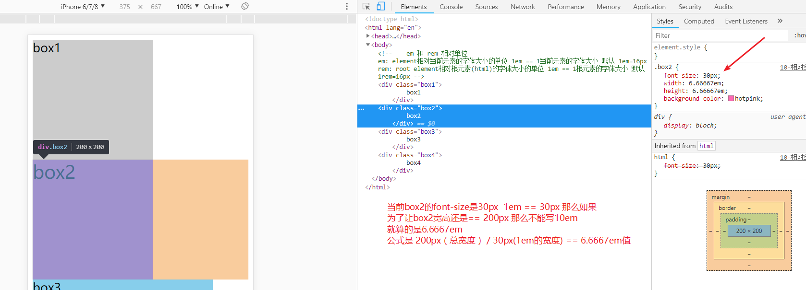
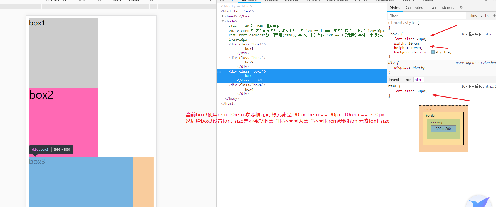
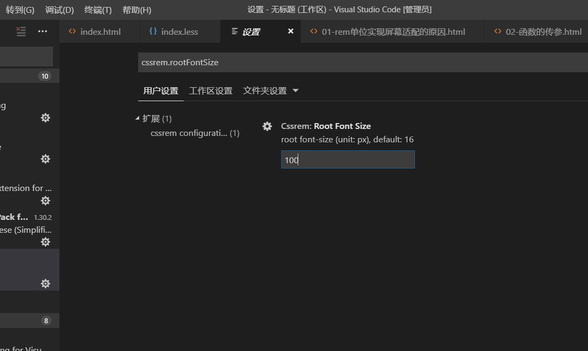

## 总结

1. 屏幕适配的概念(重点)
2. em和rem两种相对单位和区别
3. rem适配屏幕的原理
4. 使用vw配合rem实现屏幕适配(重点)
5. 使用rem完成携程首页的全局自适应布局(重点)
6. 响应式开发概念
7. 响应式开发原理媒体查询(重点)


## 移动端页面屏幕适配

1. 为什么要适配屏幕： 手机屏幕很小 页面都是全屏 不同的大小的屏幕 展示内容不一样 
2. 希望页面在任何屏幕都保持一个等比例  希望每个屏幕看到的效果都是一样的
3. 手机小 页面文字 图片 所有内容 都比较小 
4. 手机大 页面文字 图片 所有内容 都比较大

## 使用相对的单位来实现屏幕适配

1. em : element 相对自身元素的字体大小 
   div自身字体大小16  1em=16px
   div自身字体大小20  1em=20px

2. rem : root element 相对根元素的字体大小 
    html元素的字体大小16px 1rem = 16px
    html元素的字体大小30px 1rem = 30px

3. 相对单位的概念就这个单位的值不是固定的 而是参照字体大小而变化而变化  

4. em 和 rem的区别和对比

    

    

    

    


## rem适配的原理

1. 页面中都把px写成rem相对单位 都相对根元素的字体大小

2. 不同屏幕改变根元素的字体大小的值

3. 使用媒体查询方式改变根元素大小值

    ```css
    @media(width:750px){
      html{
        font-size:200px;
      }
    }
    @media(width:375px){
      html{
        font-size:100px;
      }
    }
    ```

    

4. 使用 vw单位来实现rem适配 (最简单 最先进 可能有兼容性) 如果有兼容性 引入上面js

  1. 先假设你写代码屏幕宽度  和 当前写带屏幕宽度根元素字体大小

  2. 如果使用2倍图 缩小2倍来大小 按照真实开发屏幕 375去写代码去调试 根元素 假设100

      在375屏幕vw值  100px / 375  * 100    26.66667vw

  3. 如果使用原图写代码 和设计稿原图一样大 750去调试 根元素 假设 100px

      在求750屏幕的vw值  100px / 750 * 100  13.33333vw


## 使用rem实现 jd页面的屏幕适配 （注意只有原生移动web才能使用rem  响应式开发不能使用）

1. 原理把页面的px转成rem单位

2. 根元素字体大小要随着屏幕变化而变化（等比例变化）

3. 根元素字体变化 页面使用rem单位的大小也会自动跟着变化

4. rem实现屏幕适配原理

   

5. rem 改变根元素的公式计算

   

## px转rem插件和工具使用

### 1. vscode 插件




### 2. px转rem本地工具  教学资料里面的tool.html


## 响应式开发介绍

###  了解常见的移动web的开发方式

1. 响应式开发方式： 开发一个页面 同时运行在PC端和移动端 针对不同的屏幕大小 来自动适应屏幕 展示对应端的页面的布局
2. 原生的移动web开发方式： 针对每一个端 PC端和移动端 都分别开发1个页面 PC端加载PC端的页面 移动端加载移动端的页面
3. 两种方式的对比 和应用场景
    1. 响应式开发： 一个页面适配多个终端 开发效率高 维护效率高 但是由于代码都在一个页面会造成冗余 所以运行的效率低
    应用在一些新建的网站 同时把2个端都做完 快速上线    对页面加载性能要求不高 使用响应式  新闻网站 官网 活动页面等
    2. 原生移动web开发： 要针对每个端都写1个页面 开发维护效率低 但是由于针对性强 只有对应端需要的代码 代码冗余少  运行效率高
    应用在一些老网站  PC已经上线 单独开发移动端 写2套代码  对页面加载性能要求高使用原生 电商 直播 视频 聊天等

### 学习响应式开发方式

1. 理解响应式开发的原理
    1. 获取屏幕的宽度去判断 当前是属于什么屏幕
    2. 屏幕通常有4种
        1. 大屏幕 屏幕宽度大于1200 
        2. 中屏幕 屏幕宽度大于992 小于等于1200
        3. 小屏幕 屏幕宽度大于768 小于等于992
        4. 超小屏幕 屏幕宽度小于等于768
    3. 根据不同的屏幕来改变页面的布局方式
2. 如何判断和改变布局方式
    1. 使用JS判断 和 设置行内样式的方式
    2. 使用CSS3新增的属性媒体查询来判断屏幕宽度 然后在媒体查询里面 写需要改变的样式

3. 媒体查询的语法
    @media(条件){
        //条件成立执行的代码
    }
    条件通常有3种写法
    width:1200px; 表示屏幕宽度等于1200 条件成立
    min-width:1200px; 表示屏幕宽度大于等于1200 条件成立
    max-width:1200px 表示屏幕宽度小于等于1200 条成立
    如果有多个条件可以使用 and相连
    @media(条件) and (条件2){
        //条件成立执行的代码
    }
    条件成立执行的代码就是普通的CSS 代码 里面写选择{属性:值} 的方式 当条件成立就会执行这个CSS样式
4. 媒体查询条件的判断顺序
    1. 如果使用min-width作为条件判断的时候  由于是大于等于的判断 
     假设屏幕1400  同时写了3个条件 min-widht:768px  min-width:992px min-width:1200px
     那么1400 大于 1200也大于992 也大于768 就意味着3个条件都能成立 但是一般我们会取最大的屏幕的样式也就是1200 的所以写判断的时候要从小到大的方式写 让大屏幕生效的样式把小屏幕的样式覆盖 （向下覆盖）


## 总结

    1. 移动端屏幕适配： 宽度高度 内容等都要适配 全局自适应
    2. 使用相对单位em 和 rem单位
    3. em相对自身 适配每个都要修改很麻烦
    4. rem相对根元素（html元素） 比较统一 适配只需要修改html元素的字体即可
    5. rem适配方案
        1. 假设一个根元素字体大小 （随便多少都可以 20 40 100等 不能小于12）
        2. 把页面的px转成rem单位 使用px/根元素大小 == 对应rem值
            例如根元素假设20   px/20 == 多少rem
            例如假设100  px/100 == 多少rem
        3. 根元素不会随着屏幕去变化
            1. 把根元素px变成和屏幕有关 vw 把px转成vw
            2. 公式 当前根元素px值 / 当前屏幕(视口宽度)  * 100 求到视口百分比值
                例如 100  / 375 * 100  26.6667vw
        4. 只要屏幕变了 根元素会变大变化 所有使用了rem单位都会变大变小
    6. 使用less 百分比 flex + rem 实现携程首页全局自适应布局
        1. 写页面加视口
        2. 创建less文件 写公告样式
        3. rem这种也是属于公共 在里面html字体大小   html字体大小用来实现屏幕适配不是设置文字大小
             把body文字大小设置会默认14等 也可以是rem
        4. 写的所有px都转成 
        5. 使用插件 cssrem插件 使用插件会帮你自动转换 安装这个插件
            改一下配置默认根元素16 改成你设置根元素例如100
            写例如宽度 width:100px 自然会在显示对应的rem
        6. 使用伸缩布局配合rem单位完成携程首页
            头部 左右布局 
            导航 4个
            第一个导航 flex平分
            第二三四个 左右布局
                右边又是平分布局 换行
            广告 flex平分换行
            底部居中
    7. 响应式布局： 一个页面同时适配多个屏幕（从手机到电脑等很多屏幕）
    8. 原理 使用CSS3的媒体查询 判断屏幕生效什么样式
    9. 需要考虑的屏幕
        1. 大屏幕 w>1200
        2. 中屏幕  w> 992  w < 1200
        2. 小屏幕  w> 768  w < 992
        2. 超小屏幕  w< 768
    10. 判断的写法
        1. width:值 等于这个值
        2. min-width:值 大于等于这个值  从小到到写 让大的覆盖小的
        3. max-width:值 小于等于这个值  从大到小写 让小的覆盖大的
    11. 预习bootstrap响应式框架使用
        1. 引包
        <link rel="stylesheet" href="https://cdn.jsdelivr.net/npm/bootstrap@3.3.7/dist/css/bootstrap.min.css" integrity="sha384-BVYiiSIFeK1dGmJRAkycuHAHRg32OmUcww7on3RYdg4Va+PmSTsz/K68vbdEjh4u"
       >
       2. 查看官网文档复制代码 检查元素理解代码左右